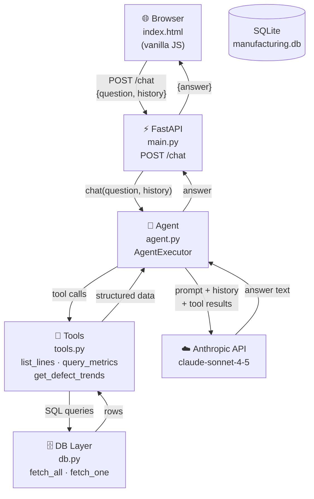
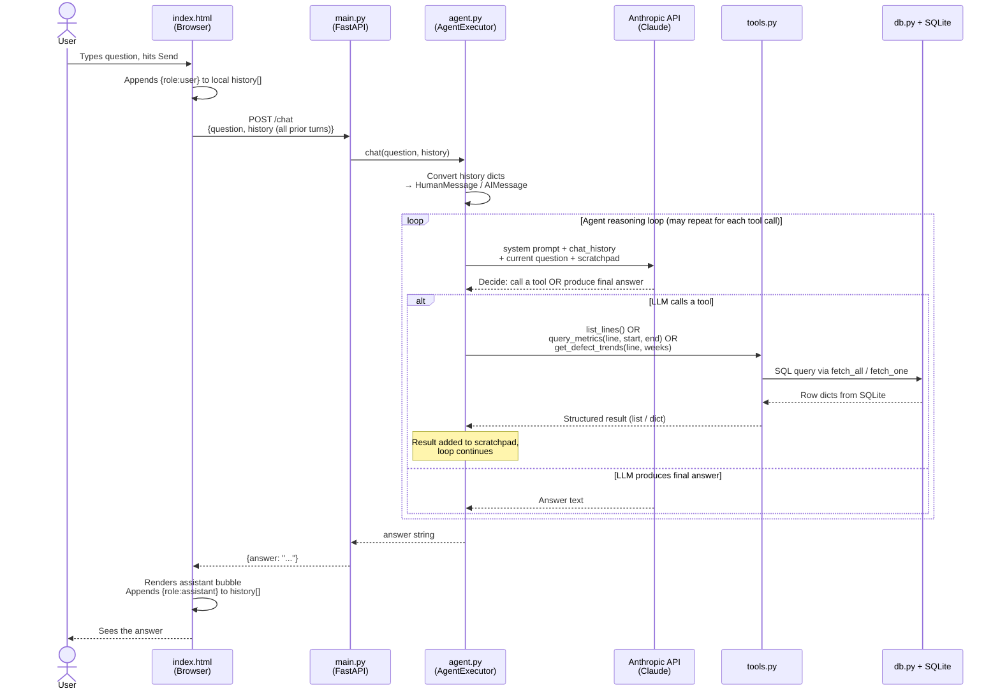

# Architecture

A plain-English walkthrough of how the Manufacturing QA Assistant is structured and how a request flows through it.

---

## Module Overview

```
app/
├── main.py    — FastAPI app: HTTP routes, request/response models
├── agent.py   — LangChain agent: prompt, memory, LLM wiring
├── tools.py   — Three @tool functions the agent can call
└── db.py      — SQLite helpers (get_connection, fetch_all, fetch_one)

app/static/
└── index.html — Single-page chat UI (vanilla JS, no framework)

data/
└── manufacturing.db — SQLite database (production_lines + daily_metrics)
```

---

## Component Diagram

Shows how the modules depend on each other and what external services they talk to.



---

## Request Flow (Sequence Diagram)

Traces a single user message from the browser through every layer and back.



---

## Memory Model

The agent itself is **stateless** — `AgentExecutor` stores nothing between calls.

Session memory is managed entirely by the browser:

```
history[] lives in JS (index.html)
│
├── On every send:   history is sent to the server as part of the request body
├── On every reply:  the assistant answer is pushed into history[]
└── On "Back" btn:   history.length = 0  →  session is reset
```

The server converts that list into LangChain `HumanMessage` / `AIMessage` objects and injects them into the prompt via `MessagesPlaceholder("chat_history")`. This gives the LLM full context of the conversation without any server-side storage.

---

## Database Schema

```
production_lines
  line_id       TEXT  PRIMARY KEY   e.g. "A"
  description   TEXT

daily_metrics
  id            INTEGER PRIMARY KEY
  line_id       TEXT    REFERENCES production_lines
  date          TEXT    YYYY-MM-DD
  units_produced INTEGER
  defect_count  INTEGER
  top_defect_type TEXT
```

---

## Tools the Agent Can Use

| Tool | When the agent uses it | Returns |
|---|---|---|
| `list_lines()` | User asks which lines exist | List of `{line_id, description}` |
| `query_metrics(line, start, end)` | User asks about a specific line + date range | `{defect_count, defect_rate, top_defect_type}` |
| `get_defect_trends(line, weeks)` | User asks for trends / week-over-week | List of `{week, defect_rate}` |

The LLM resolves relative dates ("last month", "this week") into concrete `YYYY-MM-DD` ranges before calling any tool — this is enforced in the system prompt.
