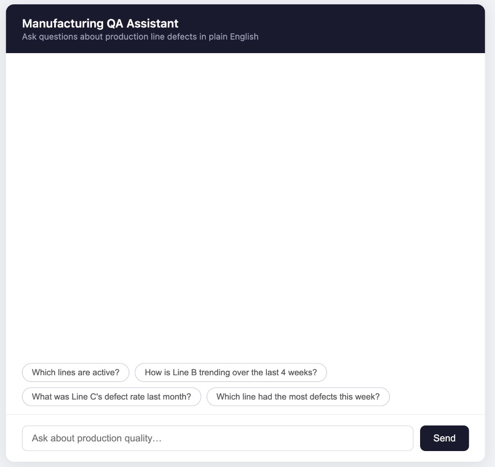
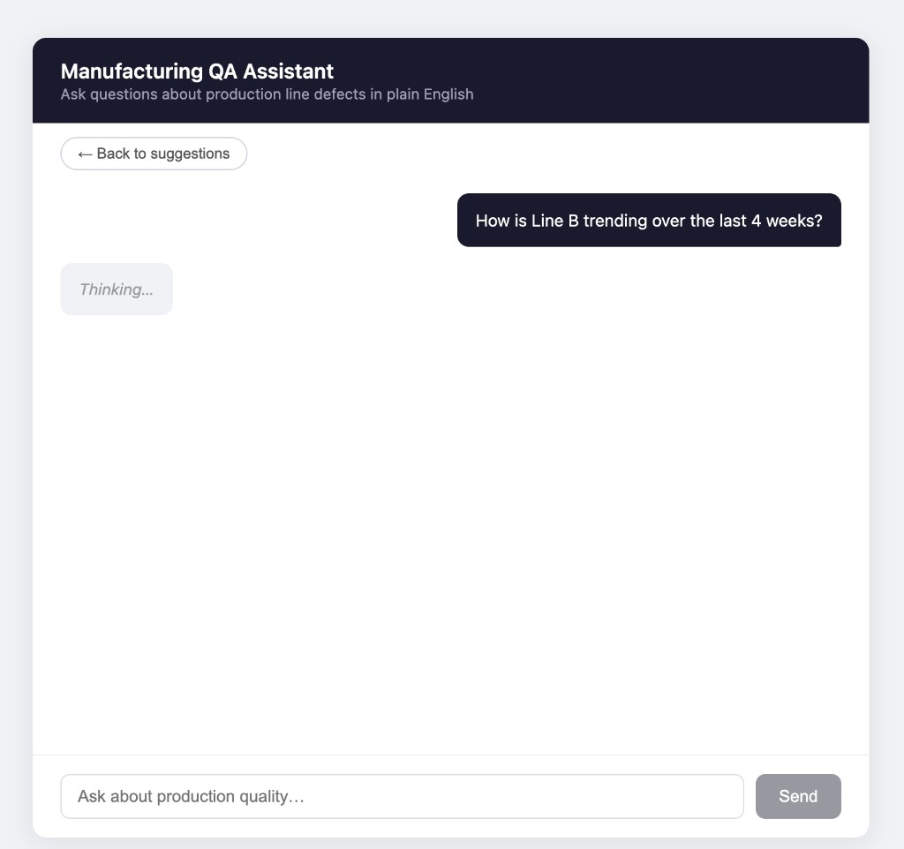
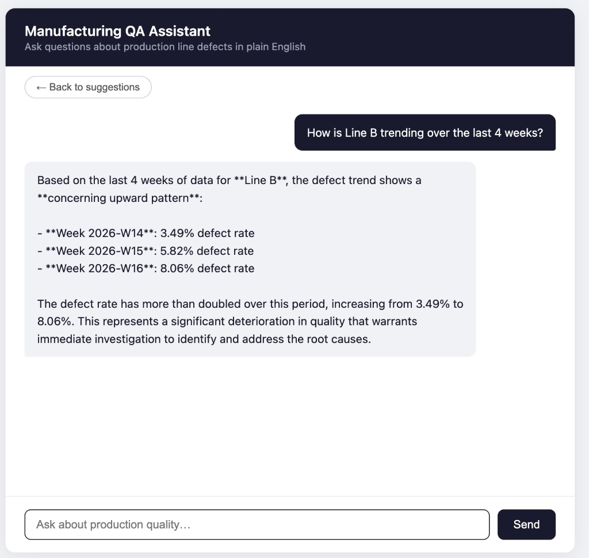

# Manufacturing QA Assistant

A LangChain agent that answers plain-English questions about manufacturing quality data.
Ask things like *"Which line had the highest defect rate last week?"* and get a direct,
data-grounded answer.

## Screenshots

| Home | Thinking | Response |
|------|----------|----------|
|  |  |  |

## Why I built this

I've spent 5+ years building production ML systems — but agent frameworks like LangChain
were missing from my toolkit. This project is my hands-on dive into agentic LLM patterns,
tool-calling, and the MLOps realities of shipping LLM apps.

## Stack

| Layer    | Tech                                               |
|----------|----------------------------------------------------|
| Backend  | Python 3.11, FastAPI                               |
| Agent    | LangChain + Anthropic Claude (`claude-sonnet-4-5`) |
| Database | SQLite (stdlib `sqlite3`)                          |
| Frontend | Single HTML file, vanilla JS                       |
| Config   | `python-dotenv`                                    |

## Project layout

```
app/
  main.py        – FastAPI app, /chat endpoint, serves UI
  agent.py       – LangChain agent setup + run logic
  tools.py       – 3 @tool-decorated functions
  db.py          – SQLite helpers
  static/
    index.html   – Chat UI
scripts/
  seed_data.py   – Generates mock data into SQLite
data/            – SQLite file lives here (gitignored)
```

## Quick start

```bash
# 1. Add your Anthropic API key
cp .env.example .env
# open .env and set ANTHROPIC_API_KEY

# 2. Run everything in one command
./start.sh
```

`start.sh` creates the virtualenv, installs dependencies, seeds the database
(90 days × 4 lines of mock data — only on first run), and starts the server.

Open [http://localhost:8000](http://localhost:8000) in your browser.

## How it works

```
┌──────────────┐
│   Browser    │  HTML + vanilla JS
└──────┬───────┘
       │ POST /chat
       ↓
┌──────────────┐
│   FastAPI    │
└──────┬───────┘
       │
       ↓
┌──────────────────────────────────────┐
│      LangChain AgentExecutor         │
│  (Claude decides which tool to call) │
└──┬─────────────┬───────────────┬─────┘
   ↓             ↓               ↓
 list_lines  query_metrics  get_defect_trends
   └─────────────┴───────────────┘
                 ↓
            ┌─────────┐
            │ SQLite  │
            └─────────┘
```

The three tools are plain Python functions registered with `@tool`. LangChain
reads their docstrings to decide which one(s) to call for a given question.
No external services — everything runs locally.

## Example questions to try

- "List all production lines"
- "How is Line B trending over the last 4 weeks?"
- "What was the defect rate on Line C six weeks ago?"
- "Which line had the most defects this week?"
- "Compare Line A and Line D for the past month"

## Limitations

- Mock data only — real integration with production systems would require a proper data pipeline and auth layer
- No eval harness yet (planned) — agent responses are verified manually
- Single-user, stateless between page refreshes

## Get your Anthropic API key

[https://console.anthropic.com/](https://console.anthropic.com/)
